# Architecture Design Document

> Weak problem statements produce over-engineered systems.

## Problem statement

Design a serverless Order Intake Service responsible for accepting customer orders via HTTP API, performing synchronous validation, durably persisting accepted orders, and emitting an event for downstream asynchronous processing.

Downstream processing failures do not affect API acceptance

**In Scope**
- Order intake via synchronous API
- Basic validation and acceptance
- Reliable handoff to downstream systems
- Database persistence
- Idempotency key validation
- Event-driven integration
- At-least-once event delivery for downstream events (make sure to implement idempotent consumers)

**Out of scope (explicit)**
- Payment processing
- Order fulfillment
- Complex workflows
- Cross-region replication
- UI for taking orders

**Success criteria**
- API responds within ≤300 ms (p95)
- Ensure no accepted order is lost
- System scales without pre-provisioning
- System is able to process bursts of requests up to 5000 RPS
- Order intake information is persisted in database
- Downstream processing failures do not affect API acceptance

### Definitions

**Validation**

Order is validated when:

1. Structural validation
  - Required fields are present
  - Types are correct for each field
  - Payload size is within the limit (1KB)
  - JSON schema is valid
2. Business validation (local only)
  - Quantity > 0
  - Custom ID format is valid
  - Constraint validation: max quantity is 100
  - No duplicate order ID exists (idempotency key)

  **Duplication**
  
Duplication is handled with idempotency key being a payload hash. The system will generate idempotency key defined as a hash of entire request. The duplicate order is defined as an order placed with the same payload within a TTL of 15 seconds.

**Persistence**

The order intake system defines its own database persistance for storing intake data. That means, the database will be used for processing duplication with idempotenty key.

## Architecture Diagram

```mermaid

architecture-beta
    group api(logos:aws-lambda)[API]

    service db(logos:aws-aurora)[Database] in api
    service disk1(logos:aws-glacier)[Storage] in api
    service disk2(logos:aws-s3)[Storage] in api
    service server(logos:aws-ec2)[Server] in api

    db:L -- R:server
    disk1:T -- B:server
    disk2:T -- B:db

```

