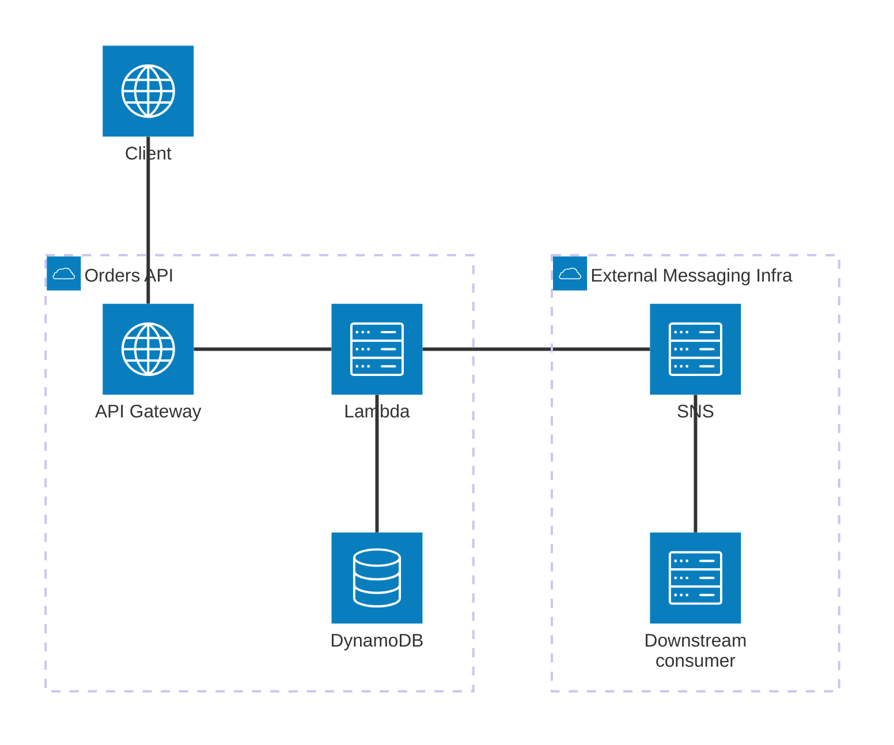
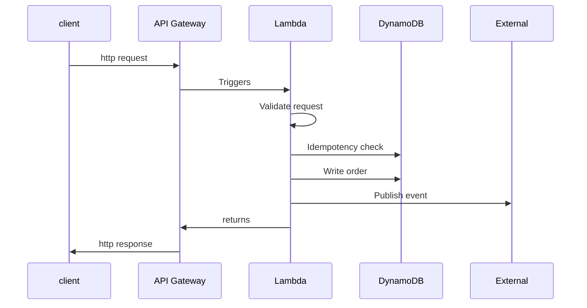

# Architecture Design Document

> Weak problem statements produce over-engineered systems.

## Problem statement

Design a serverless Order Intake Service responsible for accepting customer orders via HTTP API, performing synchronous validation, durably persisting accepted orders, and emitting an event for downstream asynchronous processing.

Downstream processing failures do not affect API acceptance

**In Scope**
- Order intake via synchronous API
- Basic validation and acceptance
- Reliable handoff to downstream systems
- Database persistence
- Idempotency key validation
- Event-driven integration
- At-least-once event delivery for downstream events (make sure to implement idempotent consumers)

**Out of scope (explicit)**
- Payment processing
- Order fulfillment
- Complex workflows
- Cross-region replication
- UI for taking orders

**Success criteria**
- API responds within ≤300 ms (p95)
- Ensure no accepted order is lost
- System scales without pre-provisioning
- System is able to process bursts of requests up to 5000 RPS
- Order intake information is persisted in database
- Downstream processing failures do not affect API acceptance

### Definitions

**Validation**

Order is validated when:

1. Structural validation
  - Required fields are present
  - Types are correct for each field
  - Payload size is within the limit (1KB)
  - JSON schema is valid
2. Business validation (local only)
  - Quantity > 0
  - Custom ID format is valid
  - Constraint validation: max quantity is 100
  - No duplicate order ID exists (idempotency key)

**Duplication**
  
Duplication is handled with idempotency key being a payload hash. The system will generate idempotency key defined as a hash of entire request. The duplicate order is defined as an order placed with the same payload within a TTL of 15 seconds.

**Persistence**

The order intake system defines its own database persistance for storing intake data. That means, the database will be used for processing duplication with idempotenty key.

## Architecture Diagram

Order Intake Service (owned)
- API Gateway
- Lambda (validation + idempotency + DB write + event publish)
- DynamoDB (owned, stores orders + idempotency keys)

External / Infrastructure
- EventBridge (or SNS) — publishes events for downstream consumers
- Downstream consumers (out of scope)

### Key Decisions

| Decision | Rationale |
| -------- | --------- |
| Idempotency via payload hash | Avoid trusting client keys; protect against duplicates |
| Validate only local rules | Keep API decoupled; downstream handles full business validation |
| Event publication part of acceptance | Ensures “no order lost” guarantee |
| Best-effort downstream | Downstream failures do not block intake service; system isolated |
| Direct publish (no outbox) | Simple for *day one*, high throughput handled by Lambda scaling |

### High-level flow

1. Client -> API Gateway
    - Receives HTTP reuest
3. Lambda
    - Local validation
    - Generate payload hash -> for idempotency
    - Conditional write to DynamoDB
    - Publish event
3. Response
      - 200 if: validated, written to DB and published
      - 400 if: validation fails
      - 500 if: any failure occurs
4. Client retry if 500

## Decision log

### Service scope boundary

**Decision:**

Order Intake Service responsibility ends after:
- Validation
- Persistence
- Event publication

**Rationale:**

- Clear bounded context
- Decouples intake from business processing
- Reduces blast radius

**Trade-off:**

Some accepted orders may later fail in downstream systems.

### Validation scope

**Decision:**

Only structural and local business validation performed. No cross-service validation (e.g., product existence).

**Rationale:**

- Avoid synchronous dependencies
- Maintain high availability
- Reduce latency

**Trade-off:**

Invalid business orders may pass intake and fail later.

### Idempotency strategy

**Decision:**

Use payload hash as idempotency key with 15-second TTL.

**Rationale:**

- Do not trust client-provided keys
- Protect against retries
- Simpler client contract

**Trade-off:**

Identical legitimate orders within TTL are treated as duplicates.

### Persistence owenership

**Decision:**

DynamoDB table fully owned by Order Intake Service.

**Rationale:**

- Strong data ownership
- Independent schema evolution
- Avoid cross-service coupling 

**Trade-off:**

Data duplication may exist across domains.

### Persistence owenership

**Decision:**

DynamoDB table fully owned by Order Intake Service.

**Rationale:**

- Strong data ownership
- Independent schema evolution
- Avoid cross-service coupling 

**Trade-off:**

Data duplication may exist across domains.

### Event publishing strategy

**Decision:**

Direct publish after successful DB write.

**Rationale:**

- Ensures “no accepted order is lost”
- Keeps architecture simple (no outbox pattern yet)
- Idempotency protects retries

**Trade-off:**

Small risk window if Lambda crashes after DB write but before publish.

### Retry & Failure Handling

**Decision:**

Rely on client retry for transient failures.

**Rationale:**

- Keeps intake stateless
- Avoids orchestration complexity
- Acceptable within defined SLA

**Trade-off:**

Relies on well-behaved clients.
